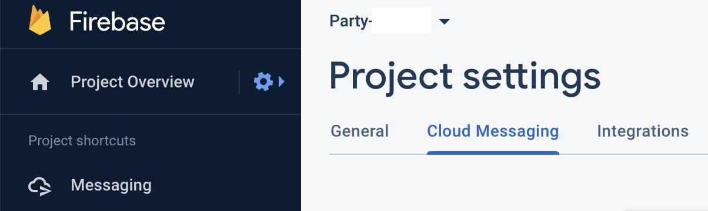
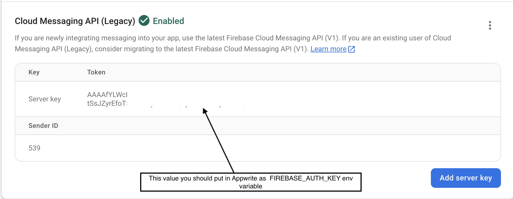

# Send push notification

A Dart Cloud Function that send push notification using Firebase Cloud Messaging to particular user

* First of all make sure that you are integrated FCM into your flutter app
    - https://firebase.flutter.dev/docs/messaging/overview/
* Generate needed `FIREBASE_AUTH_KEY` env variable

### Hot to get FCM Server Key
* Go to Messaging settings
  
* Copy server key or create a new one
  

_Example input 1:_

```json
{
  "user_token": "some_valid_token"
}
```

_Example output 1:_

```json
{
  "success": true,
  "message": "Push notification successfully sent"
}
```

_Example input 2:_

```json
{
  "user_token": ""
}
```

_Example output 2:_

```json
{
  "success": false,
  "message": "Payload has incorrect data, user_token is empty"
}
```

## 📝 Environment Variables

List of environment variables used by this cloud function:

* **FIREBASE_AUTH_KEY** - API Key for FCM

<!-- * **TINYURL_API_KEY** - API Key for TinyUrl -->

## 🚀 Deployment

1. Clone this repository, and enter this function folder:

```shell
git clone https://github.com/open-runtimes/examples.git && cd examples
cd dart/send_push_notification
```

2. Enter this function folder and build the code:

```shell
docker run -e INTERNAL_RUNTIME_ENTRYPOINT=lib/main.dart --rm --interactive --tty --volume $PWD:/usr/code openruntimes/dart:v2-2.17 sh /usr/local/src/build.sh
```

As a result, a `code.tar.gz` file will be generated.

3. Start the Open Runtime:

```shell
docker run -p 3000:3000 -e INTERNAL_RUNTIME_KEY=secret-key --rm --interactive --tty --volume $PWD/code.tar.gz:/tmp/code.tar.gz:ro openruntimes/dart:v2-2.17 sh /usr/local/src/start.sh
```

Your function is now listening on port `3000`, and you can execute it by sending `POST` request with appropriate
authorization headers. To learn more about runtime, you can visit Dart
runtime [README](https://github.com/open-runtimes/open-runtimes/tree/main/runtimes/dart-2.17).

4. Execute function:

```shell
curl http://localhost:3000/ -d '{"variables":{"FIREBASE_AUTH_KEY":"YOUR_FIREBASE_AUTH_KEY"},"payload":"{\"user_token\":\"USER_FCM_TOKEN\"}"}' -H "X-Internal-Challenge: secret-key" -H "Content-Type: application/json"
```

## 📝 Notes

* This function is designed for use with Appwrite Cloud Functions. You can learn more about it
  in [Appwrite docs](https://appwrite.io/docs/functions).
* This example is compatible with Dart 2.17. Other versions may work but are not guaranteed to work as they haven't been
  tested. Versions below Dart 2.14 will not work, because Apwrite SDK requires Dart 2.14,
