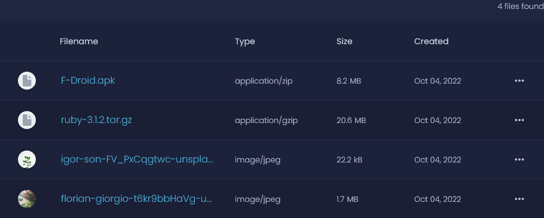

# 🚮 Wipe Appwrite Bucket

This function deletes every file from a specified Appwrite Storage Bucket.

## 🤖 Documentation

**Before:**



**After:**


_Example input:_

```JSON
{"bucketId":"profilePictures"}
```

_Example output:_

```json
{"success":true}
```

## 📝 Environment Variables

List of environment variables used by this cloud function:

- **APPWRITE_FUNCTION_ENDPOINT** - Endpoint of Appwrite project
- **APPWRITE_FUNCTION_API_KEY** - Appwrite API Key

## 🚀 Deployment

There are two ways of deploying the Appwrite function, both having the same results, but each using a different process. We highly recommend using CLI deployment to achieve the best experience.

### Using CLI

Make sure you have [Appwrite CLI](https://appwrite.io/docs/command-line#installation) installed, and you have successfully logged into your Appwrite server. To make sure Appwrite CLI is ready, you can use the command `appwrite client --debug` and it should respond with green text `✓ Success`.

Make sure you are in the same folder as your `appwrite.json` file and run `appwrite deploy function` to deploy your function. You will be prompted to select which functions you want to deploy.

### Manual using tar.gz

Manual deployment has no requirements and uses Appwrite Console to deploy the tag. First, enter the folder of your function. Then, create a tarball of the whole folder and gzip it. After creating `.tar.gz` file, visit Appwrite Console, click on the `Deploy Tag` button and switch to the `Manual` tab. There, set the `entrypoint` to `src/index.js`, and upload the file we just generated.
